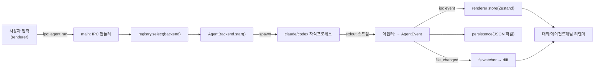

# ARCHITECTURE — AgentDeck

> *어떻게 만드는지*. 하네스 프레임워크 Layer 1. 디렉토리 구조 + 패턴 + 데이터 흐름.

## 기술 스택

> 버전은 **원본 AgentCodeGUI와 일치**(ADR-013). 충실도 레퍼런스: `C:/Dev/AgentCodeGUI` + `docs/UI.md`(ADR-014, 옛 OKLCH 타깃에서 Clay 에디토리얼 HEX 듀얼테마로 진화).

| 레이어 | 선택 | 비고 |
|---|---|---|
| 셸 | **Electron 42** (electron-vite 5) | AgentCodeGUI 벤치마킹 — NSIS·자동업데이트 동일 경로 |
| 번들러 | **Vite 7** (electron-vite 5) | main/preload/renderer 3 타깃 |
| UI | **React 19 + TypeScript 6** | renderer. React19=`React.JSX`(전역 JSX 제거) |
| 코드 인텔리전스 | **CodeMirror 6** · react-markdown+remark-gfm+rehype-highlight+highlight.js | 코드뷰어/마크다운/이미지. `fs.read` 단일채널 (ADR-012) |
| 상태관리 | **Zustand** | 가벼운 store (ADR-005) |
| 영속화 | **JSON fan-out** | 대화 = `userData/chats/<id>.json` + `index.json`, 네이티브 의존 0 (ADR-006 supersede·M1) |
| 패키징 | **electron-builder** (NSIS) | `AgentDeck-Setup-*.exe` |
| 자동업데이트 | **electron-updater** | GitHub Releases |
| 테스트 | **Vitest 3** (단위) + **Playwright `_electron`**(e2e + 시각검증 `visual-viewer`, B-tier) | 스크린샷→`artifacts/screenshots/`. 네이티브 의존 0(듀얼 ABI 댄스 제거, M1) |

## 디렉토리 구조

```
AgentDeck/
├── src/
│   ├── main/                      # Electron 메인 프로세스 (Node)  ── [main-process 에이전트]
│   │   ├── index.ts               # app 진입점, BrowserWindow, 라이프사이클
│   │   ├── 00_ipc/                   # ipcMain 핸들러 등록 (shared 계약 구현)
│   │   ├── 01_agents/                # ⭐ 백엔드 추상화          ── [agent-backend 에이전트]
│   │   │   ├── AgentBackend.ts     #    인터페이스 (공통 이벤트 모델)
│   │   │   ├── ClaudeCodeBackend.ts#    `claude -p` stream-json CLI 어댑터(현재) → Agent SDK 전환(ADR-016)
│   │   │   ├── CodexBackend.ts      #    `codex` CLI / OpenAI 어댑터
│   │   │   └── registry.ts          #    백엔드 탐지·선택·전환
│   │   ├── 04_persistence/           # JSON fan-out store (chats/<id>.json + index.json, ADR-006 supersede)
│   │   ├── 02_fs/                    # 워크스페이스 fs (M1~M2)
│   │   │   ├── workspace.ts        #    resolveSafe(경로탈출 2단 방어) + buildTree
│   │   │   ├── read.ts             #    readFileSafe — fs.read 단일채널(text/binary/이미지)
│   │   │   ├── roots.ts            #    루트 레지스트리(워크스페이스+레퍼런스, ID 게이트)
│   │   │   └── diff.ts             #    작업트리 vs HEAD 스냅샷 diff (M3: gitHeadContent 재사용)
│   │   ├── 05_settings/           # 슬래시/MCP/스킬 설정 스토어 (commands·mcp·skills)
│   │   ├── 06_window/             # 창 컨트롤·지오메트리
│   │   ├── git.ts                 # git CLI(execFile 직접, 라이브러리 0) — status/log/commit/push/pull/diff (M3)
│   │   ├── 03_lsp/                   # LSP 호스트 (M2-LSP)
│   ├── preload/                   # contextBridge (IPC 노출)       ── [shared-ipc 에이전트 게이트]
│   │   └── index.ts
│   ├── renderer/                  # React UI                       ── [renderer 에이전트]
│   │   └── src/
│   │       ├── App.tsx
│   │       ├── layout/            # 셸(F1에서 원본 4컬럼/플로팅카드로) + CodeViewerPane
│   │       ├── components/        # FileExplorer · Conversation · AgentPanel · DiffViewer
│   │       │                      #   + CodeViewer · MarkdownView · ImagePreview (M2)
│   │       ├── lib/               # viewer.ts(확장자→뷰어 라우팅) 등
│   │       ├── store/             # Zustand (appStore + reducer)
│   │       └── theme/             # 토큰(Clay 에디토리얼 HEX 듀얼테마, UI.md — 옛 OKLCH 타깃에서 진화) + darcula
│   └── shared/                    # main↔renderer 공유 계약          ── [shared-ipc 에이전트]
│       ├── ipc-contract.ts        #    채널명 + 요청/응답 타입
│       └── agent-events.ts        #    공통 에이전트 이벤트 타입
├── docs/                          # 하네스 brain
├── .claude/                       # 하네스 (agents/commands/hooks)
├── scripts/                       # 하네스 hooks + e2e 러너(run-e2e.cjs)
├── phases/                        # /work:plan이 생성하는 Phase 정의 (M{N}-{slug}/)
├── tests/                         # Vitest / Playwright            ── [qa 에이전트]
├── build/                         # 아이콘·NSIS 리소스
├── electron.vite.config.ts
├── electron-builder.yml
└── package.json
```

## 핵심 패턴

### 1. 3-프로세스 경계 (Electron 정석)
- **main** (Node 권한) — 파일시스템·자식프로세스(에이전트 CLI)·DB. 신뢰 경계의 *안쪽*.
- **preload** — `contextBridge.exposeInMainWorld('api', ...)`로 *화이트리스트된* IPC만 노출. `nodeIntegration: false`, `contextIsolation: true`.
- **renderer** (브라우저 권한) — React UI. Node 직접 접근 X. 모든 권한 작업은 IPC 경유.

> **신뢰 경계 = 하네스 "도구 경계" 기둥의 코드화.** renderer는 untrusted. main만 fs/proc/db.

### 2. 백엔드 추상화 (Adapter 패턴) ⭐
모든 엔진은 `AgentBackend`를 구현한다. 호출부(IPC 핸들러)는 구체 엔진을 모른다.

```ts
interface AgentBackend {
  readonly id: 'claude-code' | 'codex'
  isAvailable(): Promise<boolean>          // CLI/SDK 설치 탐지
  version(): Promise<string | null>
  start(req: AgentRunRequest): AgentRun     // 스트리밍 핸들 반환
}
interface AgentRun {
  readonly events: AsyncIterable<AgentEvent> // 공통 이벤트 (아래)
  abort(): void
}
// 공통 이벤트 모델 — 엔진별 출력을 여기로 정규화
type AgentEvent =
  | { type: 'text'; delta: string }
  | { type: 'tool_call'; id: string; name: string; input: unknown }
  | { type: 'tool_result'; id: string; ok: boolean; output: unknown }
  | { type: 'file_changed'; path: string; change: 'add'|'modify'|'delete' }
  | { type: 'done'; usage?: TokenUsage }
  | { type: 'error'; message: string }
```

각 어댑터의 책임 = *엔진 고유 출력(JSON 스트림/stdout) → `AgentEvent`* 변환. UI·영속화는 이 공통 모델만 본다 → 엔진 추가 = 어댑터 1개 추가.

### 3. 단방향 데이터 흐름
renderer는 store(Zustand)를 구독. IPC 이벤트가 store를 갱신 → React 리렌더. renderer가 직접 부수효과를 일으키지 않음.

### 4. 파일 변경 감지
main의 `02_fs/` watcher가 워크스페이스를 감시 + 에이전트 `file_changed` 이벤트와 대조 → "AI가 건드린 파일" 인디케이터 + diff(작업트리 vs 스냅샷) 계산.

## 데이터 흐름 (핵심 루프)



## 신뢰 경계 / 권한 (도구 경계 기둥)

| 행위 | 허용 프로세스 | 차단 |
|---|---|---|
| 파일 읽기/쓰기 | main(`02_fs/`) | renderer 직접 X |
| 자식프로세스 spawn(에이전트·git) | main(`01_agents/` spawn · `git.ts` execFile) | renderer X |
| DB 접근 | main(`04_persistence/`) | renderer X |
| 네트워크(엔진 API) | 에이전트 CLI/SDK 내부 | renderer 임의 fetch 지양 |
| API 키 | main 환경/자격증명 | renderer·로그·DB에 평문 저장 X |

## 빌드·배포 파이프라인

1. `npm run dev` — electron-vite 개발 서버(HMR).
2. `npm run build` — main/preload/renderer 번들.
3. `npm run package` — electron-builder → NSIS 설치 exe + electron-updater 메타(`latest.yml`).
4. GitHub Release 업로드 → 클라이언트 자동 업데이트 체크.

> 배포 상세 결정/트레이드오프 = [ADR.md](./ADR.md). 배포는 마일스톤 04.
