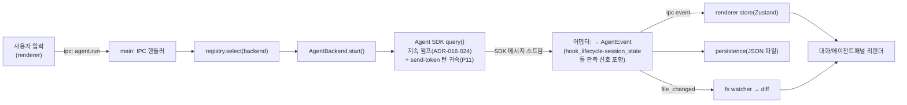

# ARCHITECTURE — AgentDeck

> *어떻게 만드는지*. 하네스 프레임워크 Layer 1. 디렉토리 구조 + 패턴 + 데이터 흐름.

## 기술 스택

> 버전은 **원본 AgentCodeGUI와 일치**(ADR-013). 충실도 레퍼런스: `C:/Dev/AgentCodeGUI` + `00.Documents/UI.md`(ADR-014, 옛 OKLCH 타깃에서 Clay 에디토리얼 HEX 듀얼테마로 진화).

| 레이어 | 선택 | 비고 |
|---|---|---|
| 셸 | **Electron 42** (electron-vite 5) | AgentCodeGUI 벤치마킹 — NSIS·자동업데이트 동일 경로 |
| 번들러 | **Vite 7** (electron-vite 5) | main/preload/renderer 3 타깃 |
| UI | **React 19 + TypeScript 6** | renderer. React19=`React.JSX`(전역 JSX 제거) |
| 코드 인텔리전스 | **CodeMirror 6** · react-markdown+remark-gfm+rehype-highlight+highlight.js | 코드뷰어/마크다운/이미지. `fs.read` 단일채널 (ADR-012) |
| 상태관리 | **Zustand** | 가벼운 store (ADR-005) |
| 영속화 | **JSON fan-out** | 대화 = `userData/chats/<id>.json` + `index.json`, 네이티브 의존 0 (ADR-006 supersede·M1) |
| 패키징 | **electron-builder** (NSIS) | `AgentDeck-Setup-*.exe` — **M5 예정, 아직 미설치** |
| 자동업데이트 | **electron-updater** | GitHub Releases — **M5 예정, 아직 미설치** |
| 테스트 | **Vitest 3** (단위) + **Playwright `_electron`**(e2e + 시각검증 `visual-viewer`, B-tier) | 스크린샷→`artifacts/screenshots/`. 네이티브 의존 0(듀얼 ABI 댄스 제거, M1) |

## 디렉토리 구조

```
AgentDeck/                         # ⚠️ 루트 = 번호접두 카테고리 (00·01·02·99 — ADR-028)
├── 00.Documents/                  # 하네스 brain (PRD·ARCHITECTURE·ADR·UI·FEATURE_MAP…)   (옛 docs/)
├── 01.Phases/                     # /work:plan이 생성하는 Phase 정의 (M{N}-{slug}/)         (옛 phases/)
├── 02.Source/                     # 앱 소스                                                 (옛 src/)
│   ├── main/                      # Electron 메인 프로세스 (Node)  ── [main-process 에이전트]
│   │   ├── index.ts               # app 진입점, BrowserWindow, 라이프사이클
│   │   ├── 00_ipc/                   # ipcMain 핸들러 — index[배선]·context[공유상태/인프라초기화, RF1 P04]·handlers/[도메인별]
│   │   ├── 01_agents/                # ⭐ 백엔드 추상화          ── [agent-backend 에이전트]
│   │   │   ├── AgentBackend.ts     #    인터페이스 (공통 이벤트 모델)
│   │   │   ├── ClaudeCodeBackend.ts#    Claude 어댑터 진입 (Agent SDK query(), ADR-016 전환완료) — RF1 P03로 7모듈 분해
│   │   │   ├── claudeAgentRun.ts   #    run 생명주기 핸들 (펌프·push-queue·abort)
│   │   │   ├── permissionCoordinator.ts # 권한경계 canUseTool·질문 결정 (push 콜백 1개만 의존)
│   │   │   ├── eventNormalizer.ts  #    엔진출력 → 공통 AgentEvent (+ fileChangeTracker·progressTrackers·modelFallback)
│   │   │   ├── sdkOptions.ts / queryFn.ts # SDK 옵션 조립 · query 함수 해석
│   │   │   ├── CodexBackend.ts      #    Codex 어댑터 (stub — 구현방식[SDK/CLI] 미확정, Track 2/M6 재설계 시 확정. isAvailable=false)
│   │   │   └── registry.ts          #    백엔드 탐지·선택·전환
│   │   ├── 04_persistence/           # JSON fan-out store (chats/<id>.json + index.json, ADR-006 supersede)
│   │   ├── 02_fs/                    # 워크스페이스 fs (M1~M2)
│   │   │   ├── workspace.ts        #    resolveSafe(경로탈출 2단 방어) + buildTree
│   │   │   ├── read.ts             #    readFileSafe — fs.read 단일채널(text/binary/이미지)
│   │   │   ├── roots.ts            #    루트 레지스트리(워크스페이스+레퍼런스, ID 게이트)
│   │   │   └── diff.ts             #    작업트리 vs HEAD 스냅샷 diff (M3: gitHeadContent 재사용)
│   │   ├── 05_settings/           # 슬래시/MCP/스킬 설정 스토어 (commands·mcp·skills)
│   │   ├── 06_window/             # 창 컨트롤·지오메트리
│   │   ├── git.ts                 # git CLI(execFile 직접, 라이브러리 0) — status/log/commit/push/pull/diff (M3)
│   │   └── 03_lsp/                # LSP 호스트 (M2-LSP)
│   ├── preload/                   # contextBridge (IPC 노출)       ── [shared-ipc 에이전트 게이트]
│   │   └── index.ts
│   ├── renderer/                  # React UI                       ── [renderer 에이전트]
│   │   └── src/
│   │       ├── App.tsx
│   │       ├── layout/            # 셸(F1에서 원본 4컬럼/플로팅카드로) + CodeViewerPane
│   │       ├── components/        # FileExplorer · Conversation · AgentPanel · DiffViewer
│   │       │                      #   + CodeViewer · MarkdownView · ImagePreview (M2)
│   │       ├── lib/               # viewer.ts(확장자→뷰어 라우팅) 등
│   │       ├── store/             # Zustand (appStore + reducer)
│   │       └── theme/             # 토큰(Clay 에디토리얼 HEX 듀얼테마, UI.md — 옛 OKLCH 타깃에서 진화) + darcula
│   └── shared/                    # main↔renderer 공유 계약          ── [shared-ipc 에이전트]
│       ├── ipc-contract.ts        #    배럴 — ipc/ 12도메인 re-export + IPC_CHANNELS spread 합성 (RF1 P09)
│       ├── ipc/                   #    도메인별 채널·타입 13파일 (common[채널無 상수/타입]·workspace·agent·fs·conversation·reference·git·lsp·engine·settings·window·multi·personalization)
│       ├── agent-events.ts        #    공통 에이전트 이벤트 타입
│       └── diff-types.ts          #    diff 라인 타입
├── 99.Others/                     # 빌드 보조·산출물 (옛 scripts/·tests/·out/)
│   ├── scripts/                   # e2e 러너(run-e2e.cjs)  ※ 하네스 hooks는 .claude/hooks/로 이동
│   ├── tests/                     # Vitest / Playwright            ── [qa 에이전트]
│   └── out/                       # 빌드 산출물(gitignore — 재생성)
├── .claude/                       # 하네스 (agents/commands/hooks/policies/templates)
├── build/                         # 아이콘·NSIS 리소스
├── electron.vite.config.ts
├── electron-builder.yml
└── package.json
```

## 핵심 패턴

### 1. 3-프로세스 경계 (Electron 정석)
- **main** (Node 권한) — 파일시스템·자식프로세스(에이전트 CLI)·DB. 신뢰 경계의 *안쪽*.
- **preload** — `contextBridge.exposeInMainWorld('api', ...)`로 *화이트리스트된* IPC만 노출. `nodeIntegration: false`, `contextIsolation: true`.
- **renderer** (브라우저 권한) — React UI. Node 직접 접근 X. 모든 권한 작업은 IPC 경유.

> **신뢰 경계 = 하네스 "도구 경계" 기둥의 코드화.** renderer는 untrusted. main만 fs/proc/db.

### 2. 백엔드 추상화 (Adapter 패턴) ⭐
모든 엔진은 `AgentBackend`를 구현한다. 호출부(IPC 핸들러)는 구체 엔진을 모른다.

```ts
interface AgentBackend {
  readonly id: 'claude-code' | 'codex'
  isAvailable(): Promise<boolean>          // CLI/SDK 설치 탐지
  version(): Promise<string | null>
  start(req: AgentRunRequest): AgentRun     // 스트리밍 핸들 반환
}
interface AgentRun {
  readonly events: AsyncIterable<AgentEvent> // 공통 이벤트 (아래)
  abort(): void
}
// 공통 이벤트 모델 — 엔진별 출력을 여기로 정규화.
// 정본 = `02.Source/shared/agent-events.ts` (discriminated union 28종 — 아래는 type 판별자 요약, 필드 상세는 정본 참조)
type AgentEvent =
  // ── 코어 루프 (M1) ──
  | { type: 'text' } | { type: 'tool_call' } | { type: 'tool_result' }
  | { type: 'file_changed' } | { type: 'done' } | { type: 'error' }
  // ── 사고·진행 표시 (M4-4) ──
  | { type: 'thinking' } | { type: 'thinking_clear' } | { type: 'todos' }
  // ── 서브에이전트·오케스트레이션 (M4-4·ADR-021·ADR-032) ──
  | { type: 'subagent' } | { type: 'orchestration' }
  | { type: 'orchestration_progress' } | { type: 'orchestration_denied' }
  // ── 양방향 요청 (M4-4 — 에이전트가 멈추고 사용자 응답 대기) ──
  | { type: 'permission_request' } | { type: 'question_request' }
  // ── 세션·루프·폴백 (REPL, ADR-024·ADR-029) ──
  | { type: 'session' } | { type: 'loops' } | { type: 'autonomy_status' }
  | { type: 'model-fallback' }
  // ── GAP1 신규 9종 (P03 계약 일괄 정의, ADR-035 — 훅·신뢰성·라이브 사고·백그라운드·검색) ──
  | { type: 'hook_lifecycle' }      // 훅 생명주기(started↔response hookId 페어링, P05 소비)
  | { type: 'informational' }       // 비-에러 정보성 배너(훅 피드백 등)
  | { type: 'permission_denied' }   // canUseTool 'deny' 단락 자동 거부 통지
  | { type: 'api_retry' }           // API 재시도 진행(레이트리밋·과부하, P04 소비)
  | { type: 'compact' }             // 컨텍스트 컴팩션 경계/진행(P04 소비)
  | { type: 'session_state' }       // SDK 실행 상태(idle/running — 옵트인 env, P04 권위 신호)
  | { type: 'thinking_delta' }      // 라이브 사고 증분·redacted 토큰 추정치(P06 소비)
  | { type: 'bg_task' }             // 백그라운드 태스크 생명주기 + kind:'output' 증분 tail 조각(P09 배선 완료 — BackgroundTaskView 소비, 정지=AGENT_TASK_STOP 채널·preload agentTaskStop)
  | { type: 'search_result' }       // Grep/Glob 구조화 검색 결과(P08 배선 완료 — 어댑터가 top-level tool_use_result를 정규화 방출, SearchResultView 소비)
```

각 어댑터의 책임 = *엔진 고유 출력(JSON 스트림/stdout) → `AgentEvent`* 변환. UI·영속화는 이 공통 모델만 본다 → 엔진 추가 = 어댑터 1개 추가.

### 3. 단방향 데이터 흐름
renderer는 store(Zustand)를 구독. IPC 이벤트가 store를 갱신 → React 리렌더. renderer가 직접 부수효과를 일으키지 않음.

### 4. 파일 변경 감지
main의 `02_fs/` watcher가 워크스페이스를 감시 + 에이전트 `file_changed` 이벤트와 대조 → "AI가 건드린 파일" 인디케이터 + diff(작업트리 vs 스냅샷) 계산.

## 데이터 흐름 (핵심 루프)



**턴 회계·신뢰성 관측 (GAP1 P04·P05·P10~P12)** — 지속 펌프(REPL)의 turn 경계는 다음으로 관리·관측된다:
- **send-token 턴 귀속 회계(P11)**: `push()`마다 seq 토큰을 발급해 queued→delivered→owned→completed로 추적 — `done`의 origin(user/cron) 판정과 idle-close "살아있을 이유" 판정의 정본(옛 pending-send 카운터의 자율 done 탈취 결함 봉합). `claudeAgentRun.ts`.
- **session_state 권위 신호(P04)**: 옵트인 env(`CLAUDE_CODE_EMIT_SESSION_STATE_EVENTS=1`) 시 SDK idle/running 신호가 idle-close 판정의 권위 — 미수신 세션은 기존 휴리스틱 유지(보강 전용).
- **stale idle 봉쇄(P10)**: 신규 dispatch 시 idle-close grace 취소 가드를 회귀 잠금으로 고정 — turn-id 스탬프 배선은 실측(misfire 부재) 후 철회, 잔여 자율 턴 조합 결함은 P11이 봉합.
- **고아 pump 종결(P12)**: error terminal(및 iterator throw) 시 run 레지스트리(`00_ipc/agent-runs.ts`)가 `run.abort()`를 명시 호출(멱등) — backend 펌프가 `_aborted=false` 고아로 남아 입력·자율 이벤트를 영원히 기다리는 유령 세션 차단.
- **훅 관측점(P05)**: 훅 실행이 `hook_lifecycle`(started↔response hookId 페어링)로 정규화되어 renderer HookTimeline까지 배선.

### 멀티세션 영속 — 단일 기록자 (multi-agent.json, ADR-031)

renderer는 `multi-agent.json`을 직접 조립(read-modify-write)하지 않는다. **의도 명령 5종**(`multi.cmdUpsert/cmdCreate/cmdDelete/cmdRename/cmdSelect`)을 IPC로 보내면 main(`multiStore.ts` 순수 병합 함수 + `00_ipc/handlers/multi.ts`)이 read→merge→write를 **동기(run-to-completion) 원자 블록**으로 실행한다 — 단일 기록자 = main. 명령 응답의 병합 후 권위 상태로 renderer Zustand가 미러 동기화하고, 읽기 복원은 `MULTI_SESSION_LOAD`로 유지한다(blob 통짜 SAVE 채널은 RMW1에서 제거 — renderer 측 RMW 재발은 컴파일 타임에 불가능).

## 신뢰 경계 / 권한 (도구 경계 기둥)

| 행위 | 허용 프로세스 | 차단 |
|---|---|---|
| 파일 읽기/쓰기 | main(`02_fs/`) | renderer 직접 X |
| 자식프로세스 spawn(에이전트·git) | main(`01_agents/` spawn · `git.ts` execFile) | renderer X |
| DB 접근 | main(`04_persistence/`) | renderer X |
| 네트워크(엔진 API) | 에이전트 CLI/SDK 내부 | renderer 임의 fetch 지양 |
| API 키 | main 환경/자격증명 | renderer·로그·DB에 평문 저장 X |

> P09 신규: 백그라운드 태스크 정지 채널 `agent.taskStop`(preload `agentTaskStop`)의 runId·taskId는 renderer발 untrusted string — main 핸들러가 존재 검증 후에만 `AgentRun.stopTask()`로 전달한다(미존재 시 `accepted:false`).

## 빌드·배포 파이프라인

1. `npm run dev` — electron-vite 개발 서버(HMR).
2. `npm run build` — main/preload/renderer 번들.
3. `npm run package` — electron-builder → NSIS 설치 exe + electron-updater 메타(`latest.yml`).
4. GitHub Release 업로드 → 클라이언트 자동 업데이트 체크.

> 배포 상세 결정/트레이드오프 = [ADR.md](./ADR.md). 배포는 M5(GAP1 게이트 통과 후) 예정.
