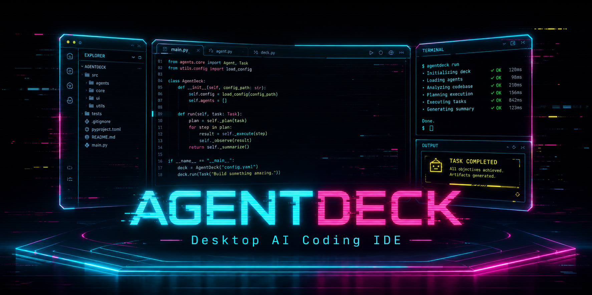

# AgentDeck



> 대화로 코딩하고, 그 자리에서 코드를 읽고, Git까지 — 데스크톱 AI 코딩 IDE.

**왜 만들었나.** AI 도구를 '사용'하는 것과 그 원리를 아는 것은 다르다고 생각해서,
**Claude Agent SDK 위에서 에이전트가 실제로 돌아가는 원리를 직접 구현하며 이해**하려고
시작했습니다. 동시에 매일 쓰는 코딩 에이전트 환경을 제 손에 맞게 만든 자가 사용
도구이기도 합니다. MIT로 공개합니다.

<!-- TODO: 스크린샷/데모 GIF — 3-pane 셸에서 폴더열기→대화→diff 흐름 -->

**현재 상태 (2026-07)**: Track 1의 M1~M4 + M2-LSP 완료 ✅ · GAP1(Claude Code 코어
패리티) 진행 중 · M5(배포) 예정. 최근: 라이브 모델 스위치(LM1).

## 지금 동작하는 것

- **핵심 루프**: 폴더 열기 → 대화 → Claude Code 스트리밍 실행 → 파일변경 인디케이터 + diff → 재시작 시 대화 복구
- **코드 인텔리전스**: CodeMirror 6 코드뷰어 · LSP 호버/정의이동/시맨틱 토큰(ts·pyright 번들) · 마크다운 렌더(XSS/원격차단/CSP) · 이미지 프리뷰 · 읽기전용 레퍼런스 폴더
- **Git 통합**: 비주얼 히스토리 · 브랜치/태그 · AI 커밋(에이전트 위임) — 라이브러리 0, `execFile` 직접
- **멀티에이전트**: 6패널 동시 실행 · 세션 CRUD · 서브에이전트 카드 · 권한/질문 양방향 · 슬래시 커맨드 · 이미지 첨부 · 토큰 게이지 · 라이브 모델 스위치

## 아키텍처 하이라이트

- **얇은 `AgentBackend` 이음** — 백엔드 교체(Claude ↔ Codex)를 설계 단계부터 대비 (Track 2에서 Codex 듀얼 백엔드)
- **네이티브 모듈 0** — 대화 영속화는 JSON fan-out(`userData/chats/<id>.json` + `index.json`). 빌드/테스트에 ABI rebuild 불필요, 영속화가 실패해도 앱은 정상 실행
- **결정론적 e2e** — echo 백엔드 + 임시 워크스페이스로 핵심 루프를 실제 Electron 런타임에서 검증 (Playwright)

## 기술 스택

Electron · Vite · React · TypeScript · Zustand · **Claude Agent SDK** · CodeMirror 6 · Vitest · Playwright · electron-builder(NSIS) · electron-updater

## 빠른 시작

```bash
npm install
npm run dev    # 개발 모드 (HMR)
```

## 테스트

```bash
npm run test       # 단위·통합 (Vitest, node ABI)
npm run test:e2e   # Electron e2e (Playwright) — build→electron ABI→실행→node ABI 복구
npm run typecheck  # 타입검사 (main+renderer)
```

## 개발 문화 — 하네스 엔지니어링

이 저장소는 AI에게 코드를 "시키는" 게 아니라 **AI를 운영하는 구조**로 개발됩니다:
`00.Documents/`(brain) + `CLAUDE.md`(헌법) + `.claude/`(멀티에이전트·hooks) +
`/work:plan`(Phase 정의 생성 → 세션/루프 실행) + `/review`(규칙 기반 점검).

1. `00.Documents/` 채우기/보강 (PRD·ARCHITECTURE·ADR·UI)
2. `/work-plan` → docs 읽고 Phase 분해 → `/work:plan` → 순차 실행
3. `/review` → 규칙 기반 점검 → docs 보강 → 재실행

## 문서

- [00.Documents/PRD.md](./00.Documents/PRD.md) · [ARCHITECTURE](./00.Documents/ARCHITECTURE.md) · [ADR](./00.Documents/ADR.md) · [UI](./00.Documents/UI.md) · [FEATURE_MAP](./00.Documents/FEATURE_MAP.md)
- [CLAUDE.md](./CLAUDE.md) — 헌법(절대 규칙)

## 로드맵

**Track 1 — 핵심 IDE (Claude Code)**
- ✅ **M1 핵심 루프** — 폴더 열기 → 대화 → 스트리밍 실행 → 파일변경/diff + 영속화
- ✅ **M2 코드 인텔리전스** (+ M2-LSP) — 코드뷰어·LSP·마크다운·이미지·레퍼런스 폴더
- ✅ **M3 Git 통합** — 비주얼 히스토리·브랜치/태그·AI 커밋
- ✅ **M4 멀티에이전트 & 대화 고도화** — 동시 6패널·서브에이전트·슬래시·토큰 게이지
- 🔄 **GAP1 — Claude Code 코어 패리티 게이트** (진행 중)
- ⬜ **M5 배포 & 플랫폼** — NSIS 설치·electron-updater·라이트 테마 → Track 1 완성

**Track 2 — 확장 (Track 1 이후)**
- ⬜ **M6 Codex 듀얼 백엔드** — `codex` 어댑터 실동작 + 엔진 전환 UI
- ⬜ **M7+ 우리 확장** — 프로젝트 하네스 씌우기·백엔드 비용 비교 등

## 라이선스

[MIT](./LICENSE) © 2026 Youngho Yoo
