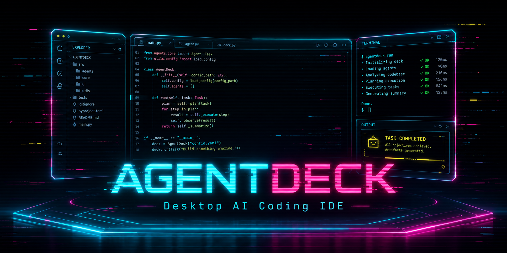
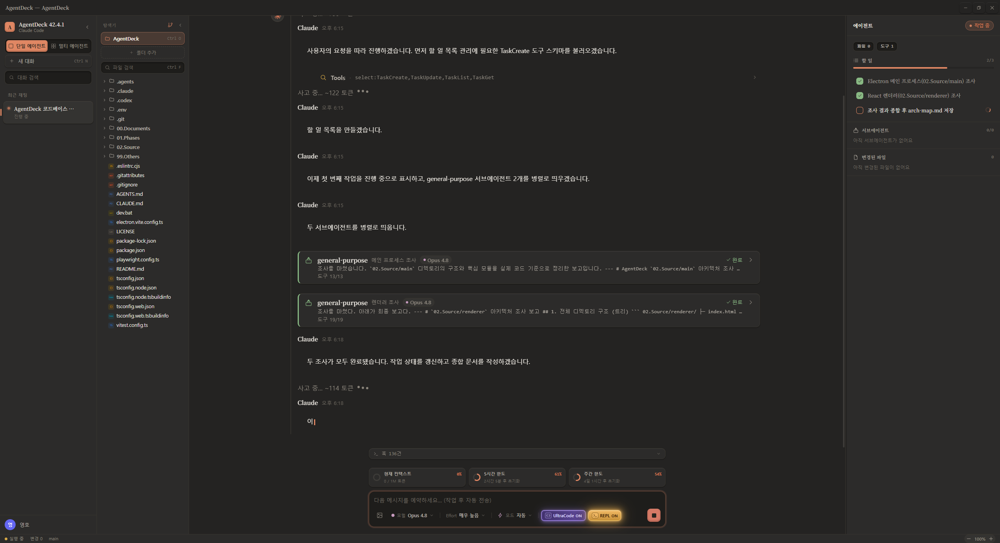
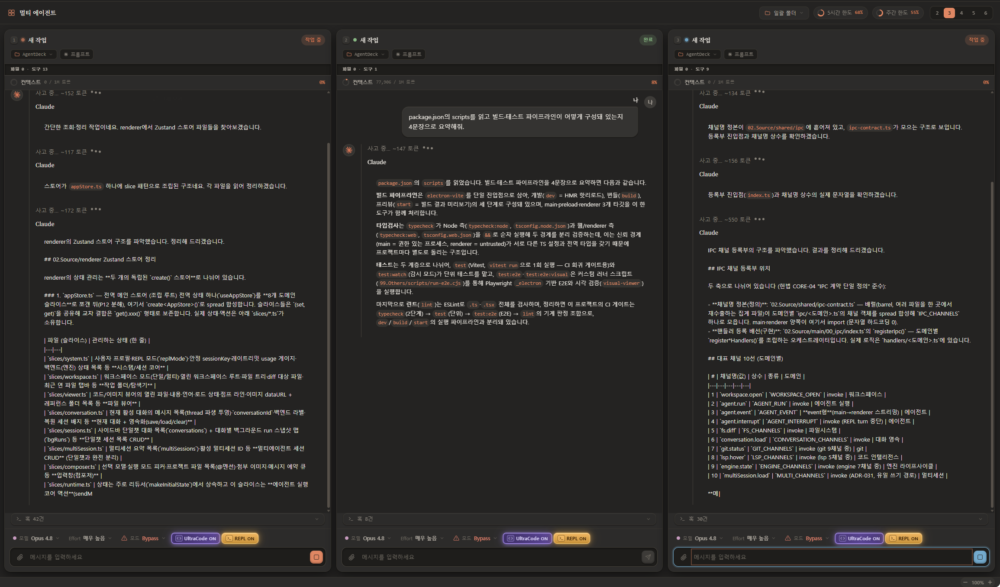
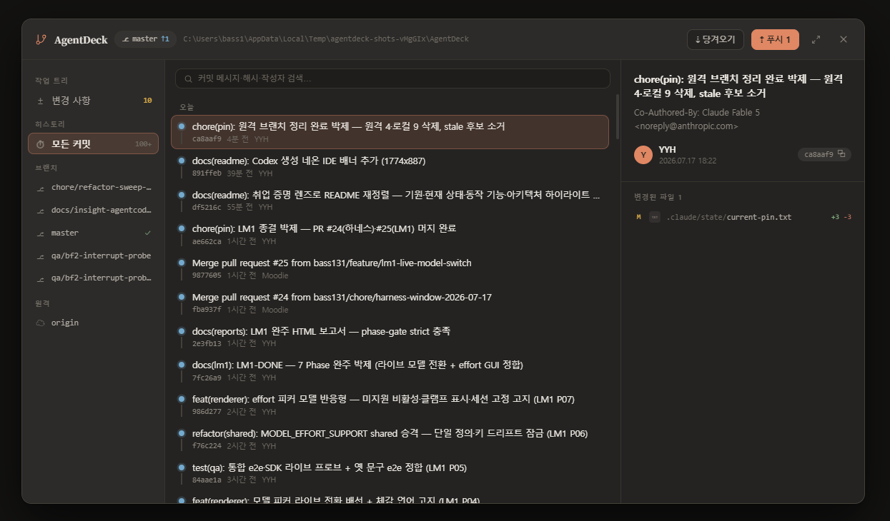

# AgentDeck



> 대화로 코드를 작성하고, 같은 화면에서 읽고, Git 작업까지 처리하는 데스크톱 AI 코딩 IDE.

**개발 배경.** AI 도구를 사용하는 데서 그치지 않고, Claude Agent SDK 기반 에이전트의
실행 원리를 직접 구현하며 이해하고자 시작했습니다. 실제 개발 과정에서 매일 사용할 수
있도록 제 작업 방식에 맞춰 만든 도구이며, MIT 라이선스로 공개합니다.



*AgentDeck으로 AgentDeck 저장소를 분석하는 모습. 할 일 추적, general-purpose 서브에이전트 2개 병렬 실행, 도구 트레이스, 컨텍스트·사용량 게이지를 확인할 수 있습니다. 화면은 Playwright 스펙 [`readme-shots.e2e.ts`](./02_Project/01_TestCode/e2e/readme-shots.e2e.ts)로 재현할 수 있습니다.*



*같은 저장소에서 서로 다른 분석을 동시에 실행하는 멀티 에이전트 화면. 세 패널의 진행 상태와 컨텍스트 사용량을 각각 확인할 수 있습니다.*



*앱 안에서 커밋 이력과 상세 내용을 확인하고 push·pull을 실행할 수 있습니다. 별도 Git 라이브러리 없이 `execFile`을 직접 사용합니다.*

<!-- TODO: 데모 GIF — 3-pane 셸에서 폴더열기→대화→diff 흐름 -->

**현재 상태 (2026-07)**: Track 1의 M1~M4와 M2-LSP 완료 ✅ · GAP1(Claude Code 코어
패리티) 진행 중 · M5(배포) 예정. 최근 작업: 라이브 모델 스위치(LM1).

## 지금 동작하는 것

- **핵심 루프**: 폴더 열기 → 대화 → Claude Code 스트리밍 실행 → 변경 파일 표시와 diff 확인 → 앱 재시작 후 대화 복구
- **코드 인텔리전스**: CodeMirror 6 코드 뷰어 · LSP 호버/정의 이동/시맨틱 토큰(ts·pyright 번들) · 마크다운 렌더링(XSS·원격 차단, CSP) · 이미지 미리보기 · 읽기 전용 레퍼런스 폴더
- **Git 통합**: 커밋 이력 시각화 · 브랜치/태그 · 에이전트에게 커밋 생성을 위임하는 AI 커밋 — 별도 Git 라이브러리 없이 `execFile` 직접 사용
- **멀티 에이전트**: 6개 패널 동시 실행 · 세션 CRUD · 서브에이전트 카드 · 권한 요청과 질문 응답 · 슬래시 커맨드 · 이미지 첨부 · 토큰 게이지 · 라이브 모델 스위치

## 아키텍처 하이라이트

- **얇은 `AgentBackend` 경계** — 설계 단계부터 백엔드를 교체할 수 있도록 구성했습니다. Track 2에서 Claude와 Codex를 지원하는 듀얼 백엔드로 확장할 예정입니다.
- **네이티브 모듈 0개** — 대화는 JSON fan-out(`userData/chats/<id>.json` + `index.json`) 방식으로 저장합니다. 빌드·테스트 때 ABI를 다시 빌드할 필요가 없고, 저장에 실패해도 앱 실행은 유지됩니다.
- **결정론적 e2e** — echo 백엔드와 임시 워크스페이스를 사용해 실제 Electron 런타임에서 핵심 루프를 검증합니다(Playwright).

## 기술 스택

Electron · Vite · React · TypeScript · Zustand · **Claude Agent SDK** · CodeMirror 6 · Vitest · Playwright · electron-builder(NSIS) · electron-updater

## 빠른 시작

```bash
npm install
npm run dev    # 개발 모드 (HMR)
```

## 테스트

```bash
npm run test       # 단위·통합 (Vitest, node ABI)
npm run test:e2e   # Electron e2e (Playwright) — build→electron ABI→실행→node ABI 복구
npm run typecheck  # 타입검사 (main+renderer)
```

## 개발 방식 — 하네스 엔지니어링

코드 생성을 AI에 맡기는 데서 그치지 않고, 계획·실행·검증 과정을 저장소 규칙으로
관리합니다. `00_Documents/`(문서)와 `CLAUDE.md`(규칙), `.claude/`(멀티 에이전트·hooks),
`/work:plan`(Phase 정의와 실행), `/review`(규칙 기반 점검)를 사용합니다.

1. `00_Documents/02_Rules/`에 계획 템플릿·모델 라우팅 정책·보고서 표준을 보강하고, 주요 결정을 `98_Management/00_ADR/`에 기록
2. `/work-plan` → 관련 문서를 읽고 Phase 분해 → `/work:plan` → 순차 실행
3. `/review` → 규칙에 따라 점검 → 관련 문서 보강 → 재실행

## 문서

- [00_Documents/](./00_Documents/) — 프로젝트 문서 · [02_Rules](./00_Documents/02_Rules/) — 계획 템플릿·모델 라우팅·보고서 표준
- [98_Management/00_ADR/](./98_Management/00_ADR/) — 주요 의사결정 기록
- PRD · ARCHITECTURE · UI · FEATURE_MAP — 문서 재편 과정에서 제외되었으며, 복원 후 다시 연결할 예정입니다.
- [CLAUDE.md](./CLAUDE.md) — 헌법(절대 규칙)

## 로드맵

**Track 1 — 핵심 IDE (Claude Code)**
- ✅ **M1 핵심 루프** — 폴더 열기 → 대화 → 스트리밍 실행 → 파일변경/diff + 영속화
- ✅ **M2 코드 인텔리전스** (+ M2-LSP) — 코드뷰어·LSP·마크다운·이미지·레퍼런스 폴더
- ✅ **M3 Git 통합** — 비주얼 히스토리·브랜치/태그·AI 커밋
- ✅ **M4 멀티에이전트 & 대화 고도화** — 동시 6패널·서브에이전트·슬래시·토큰 게이지
- 🔄 **GAP1 — Claude Code 코어 패리티 게이트** (진행 중)
- ⬜ **M5 배포 & 플랫폼** — NSIS 설치·electron-updater·라이트 테마 → Track 1 완성

**Track 2 — 확장 (Track 1 이후)**
- ⬜ **M6 Codex 듀얼 백엔드** — `codex` 어댑터 실동작 + 엔진 전환 UI
- ⬜ **M7+ 프로젝트 확장** — 프로젝트별 하네스 적용·백엔드 비용 비교 등

## 라이선스

[MIT](./LICENSE) © 2026 Youngho Yoo
