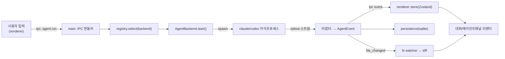

# ARCHITECTURE — AgentDeck

> *어떻게 만드는지*. 하네스 프레임워크 Layer 1. 디렉토리 구조 + 패턴 + 데이터 흐름.

## 기술 스택

| 레이어 | 선택 | 비고 |
|---|---|---|
| 셸 | **Electron** (electron-vite) | AgentCodeGUI 벤치마킹 — 배포(NSIS)·자동업데이트 동일 경로 |
| 번들러 | **Vite** (electron-vite) | main/preload/renderer 3 타깃 |
| UI | **React + TypeScript** | renderer |
| 상태관리 | **Zustand** | 가벼운 store (ADR-005) |
| 영속화 | **better-sqlite3** | 대화·diff·draft 로컬 DB (ADR-006) |
| 패키징 | **electron-builder** (NSIS) | `AgentDeck-Setup-*.exe` |
| 자동업데이트 | **electron-updater** | GitHub Releases |
| 테스트 | **Vitest** (단위) + **Playwright**(e2e, B-tier) | |

## 디렉토리 구조

```
AgentDeck/
├── src/
│   ├── main/                      # Electron 메인 프로세스 (Node)  ── [main-process 에이전트]
│   │   ├── index.ts               # app 진입점, BrowserWindow, 라이프사이클
│   │   ├── ipc/                   # ipcMain 핸들러 등록 (shared 계약 구현)
│   │   ├── agents/                # ⭐ 백엔드 추상화          ── [agent-backend 에이전트]
│   │   │   ├── AgentBackend.ts     #    인터페이스 (공통 이벤트 모델)
│   │   │   ├── ClaudeCodeBackend.ts#    Agent SDK / `claude -p` 어댑터
│   │   │   ├── CodexBackend.ts      #    `codex` CLI / OpenAI 어댑터
│   │   │   └── registry.ts          #    백엔드 탐지·선택·전환
│   │   ├── persistence/           # better-sqlite3 (대화/diff/draft)
│   │   ├── fs/                    # 워크스페이스 파일 watch + diff 계산
│   │   ├── git/                   # simple-git 래퍼 (B-tier)
│   │   └── lsp/                   # LSP 호스트 (B-tier)
│   ├── preload/                   # contextBridge (IPC 노출)       ── [shared-ipc 에이전트 게이트]
│   │   └── index.ts
│   ├── renderer/                  # React UI                       ── [renderer 에이전트]
│   │   └── src/
│   │       ├── App.tsx
│   │       ├── layout/            # 3-pane 셸
│   │       ├── components/        # explorer / conversation / agent-panel / diff
│   │       ├── store/             # Zustand
│   │       └── theme/             # 다크/라이트 토큰
│   └── shared/                    # main↔renderer 공유 계약          ── [shared-ipc 에이전트]
│       ├── ipc-contract.ts        #    채널명 + 요청/응답 타입
│       └── agent-events.ts        #    공통 에이전트 이벤트 타입
├── docs/                          # 하네스 brain
├── .claude/                       # 하네스 (agents/commands/hooks)
├── scripts/                       # execute.py + hooks
├── phases/                        # Phase 정의 + 실행 상태
├── tests/                         # Vitest / Playwright            ── [qa 에이전트]
├── build/                         # 아이콘·NSIS 리소스
├── electron.vite.config.ts
├── electron-builder.yml
└── package.json
```

## 핵심 패턴

### 1. 3-프로세스 경계 (Electron 정석)
- **main** (Node 권한) — 파일시스템·자식프로세스(에이전트 CLI)·DB. 신뢰 경계의 *안쪽*.
- **preload** — `contextBridge.exposeInMainWorld('api', ...)`로 *화이트리스트된* IPC만 노출. `nodeIntegration: false`, `contextIsolation: true`.
- **renderer** (브라우저 권한) — React UI. Node 직접 접근 X. 모든 권한 작업은 IPC 경유.

> **신뢰 경계 = 하네스 "도구 경계" 기둥의 코드화.** renderer는 untrusted. main만 fs/proc/db.

### 2. 백엔드 추상화 (Adapter 패턴) ⭐
모든 엔진은 `AgentBackend`를 구현한다. 호출부(IPC 핸들러)는 구체 엔진을 모른다.

```ts
interface AgentBackend {
  readonly id: 'claude-code' | 'codex'
  isAvailable(): Promise<boolean>          // CLI/SDK 설치 탐지
  version(): Promise<string | null>
  start(req: AgentRunRequest): AgentRun     // 스트리밍 핸들 반환
}
interface AgentRun {
  readonly events: AsyncIterable<AgentEvent> // 공통 이벤트 (아래)
  abort(): void
}
// 공통 이벤트 모델 — 엔진별 출력을 여기로 정규화
type AgentEvent =
  | { type: 'text'; delta: string }
  | { type: 'tool_call'; id: string; name: string; input: unknown }
  | { type: 'tool_result'; id: string; ok: boolean; output: unknown }
  | { type: 'file_changed'; path: string; change: 'add'|'modify'|'delete' }
  | { type: 'done'; usage?: TokenUsage }
  | { type: 'error'; message: string }
```

각 어댑터의 책임 = *엔진 고유 출력(JSON 스트림/stdout) → `AgentEvent`* 변환. UI·영속화는 이 공통 모델만 본다 → 엔진 추가 = 어댑터 1개 추가.

### 3. 단방향 데이터 흐름
renderer는 store(Zustand)를 구독. IPC 이벤트가 store를 갱신 → React 리렌더. renderer가 직접 부수효과를 일으키지 않음.

### 4. 파일 변경 감지
main의 `fs/` watcher가 워크스페이스를 감시 + 에이전트 `file_changed` 이벤트와 대조 → "AI가 건드린 파일" 인디케이터 + diff(작업트리 vs 스냅샷) 계산.

## 데이터 흐름 (핵심 루프)



## 신뢰 경계 / 권한 (도구 경계 기둥)

| 행위 | 허용 프로세스 | 차단 |
|---|---|---|
| 파일 읽기/쓰기 | main(`fs/`) | renderer 직접 X |
| 자식프로세스 spawn(에이전트) | main(`agents/`) | renderer X |
| DB 접근 | main(`persistence/`) | renderer X |
| 네트워크(엔진 API) | 에이전트 CLI/SDK 내부 | renderer 임의 fetch 지양 |
| API 키 | main 환경/자격증명 | renderer·로그·DB에 평문 저장 X |

## 빌드·배포 파이프라인

1. `npm run dev` — electron-vite 개발 서버(HMR).
2. `npm run build` — main/preload/renderer 번들.
3. `npm run package` — electron-builder → NSIS 설치 exe + electron-updater 메타(`latest.yml`).
4. GitHub Release 업로드 → 클라이언트 자동 업데이트 체크.

> 배포 상세 결정/트레이드오프 = [ADR.md](./ADR.md). 배포는 마일스톤 04.
